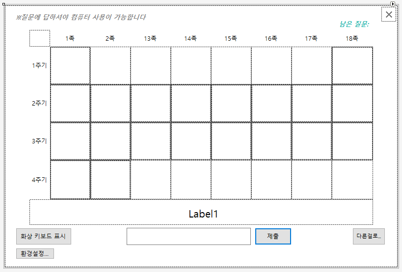
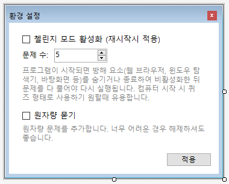

# ptable_ask
VB.net으로 제작된 간단 주기율표 퀴즈 프로그램입니다.

# 주요 기능
- **주기율표 퀴즈:** 1-20족까지 간단하게 구성된 빈 주기율표에 체크된 항목의 원자번호, 원소기호, 원소명 혹은 원자량을 입력하여 문제를 해결합니다.
- **챌린지 모드:** '환경설정'에서 첼린지 모드를 활성화하여 프로그램이 시작되는 순간 *explorer.exe*와 *chrome.exe*와 같이 프로그램을 종료할 수 있거나 방해할 수 있는 프로세스들을 종료하여 문제를 모두 맞출 때 까지 임의로 종료하지 못하도록 할 수 있습니다.

# 스크린샷

